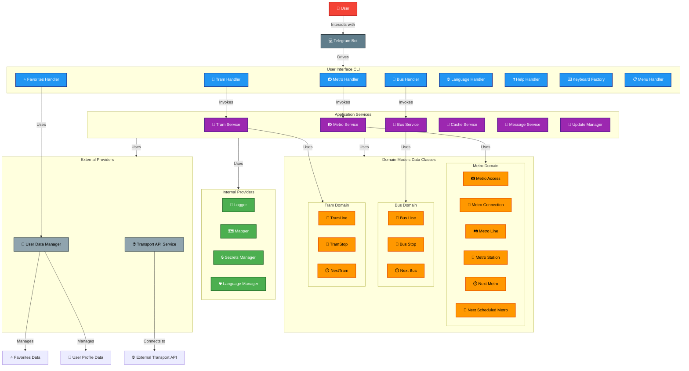

    

	
	
    
	

<!-- default option, no dependency badges. -->

	<!-- default option, no dependency badges. -->

## 🔗 Table of Contents

- [📍 Overview](#-overview)
- [👾 Features](#-features)
- [🚀 Getting Started](#-getting-started)
- [🛠️ Project Architecture](#-project-architecture)
- [📌 Project Roadmap](#-project-roadmap)
- [🔰 Contributing](#-contributing)
- [🎗 License](#-license)
- [🙌 Acknowledgments](#-acknowledgments)

---

## 📍 Overview

<code>BCN Transit Bot</code> is a Telegram bot that helps you explore and navigate Barcelona’s public transportation system.
It provides real-time information about metro, bus and tram stops, interactive maps, and lets you save your favorite stations for quick access.

## 👾 Features

- 🗺️ <b>Interactive Map:</b> Select bus, metro or tram stops directly from a map.

- 🚏 <b>Stop Information:</b> Get detailed info about stops and lines in real time.

- ⭐ <b>Favorites:</b> Add and manage your favorite stations for faster access.

- 🌐 <b>Language Support:</b> Switch between English, Spanish, and Catalan for a personalized experience.

- 📊 <b>Usage Tracking:</b> Keeps track of user sessions to improve experience.

## 🚀 Getting Started

You don’t need to install anything to try <code>BCN Transit Bot</code>.
The bot is already deployed and available on Telegram:

👉 [BCN Transit Bot](https://t.me/BCN_Transit_Bot)

Just open the link, start the bot, and explore Barcelona’s metro and bus network in real time.

https://github.com/user-attachments/assets/824458b8-456d-4c1b-a00f-a180094d11cd

## 🛠️ Project Architecture

## 🔰 Contributing

Contributions are welcome! Please read the [Contributing Guide](./CONTRIBUTING.md) to get started.

- **🐛 [Report Issues](https://github.com/mg-diego/BCN-Transit-Bot/issues)**: Submit bugs found or log feature requests for the `BCN-Transit-Bot` project.
- **💡 [Submit Pull Requests](https://github.com/mg-diego/BCN-Transit-Bot/blob/main/CONTRIBUTING.md)**: Review open PRs, and submit your own PRs.

 

   

## 🎗 License

This project is licensed under the [Apache License 2.0](https://www.apache.org/licenses/LICENSE-2.0).

You are free to use, modify, and distribute this software in compliance with the license terms.  
See the [LICENSE](./LICENSE) file for full details.

---
