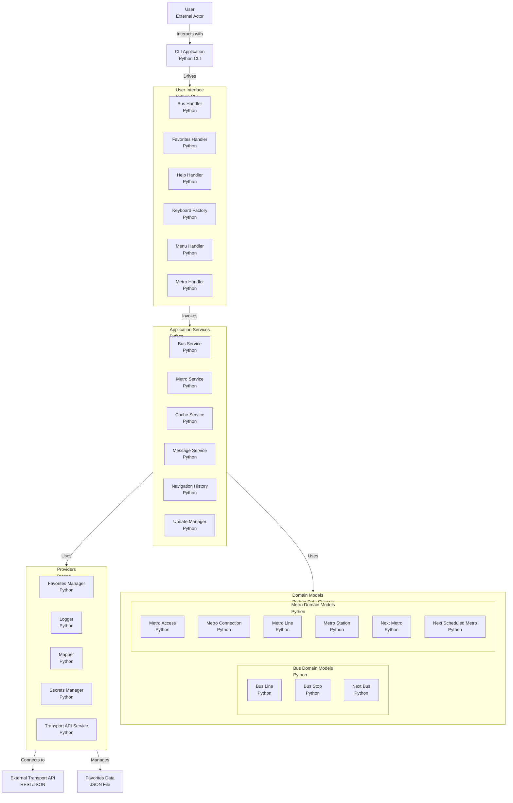

<p align="center">
    
</p>
<p align="center">
	
	
    
	
</p>
<p align="center"><!-- default option, no dependency badges. -->
</p>
<p align="center">
	<!-- default option, no dependency badges. -->
</p>
<br>

## 🔗 Table of Contents

- [📍 Overview](#-overview)
- [👾 Features](#-features)
- [🚀 Getting Started](#-getting-started)
- [🛠️ Project Architecture](#-project-architecture)
- [📌 Project Roadmap](#-project-roadmap)
- [🔰 Contributing](#-contributing)
- [🎗 License](#-license)
- [🙌 Acknowledgments](#-acknowledgments)

---

## 📍 Overview

<code>BCN Transit Bot</code> is a Telegram bot that helps you explore and navigate Barcelona’s public transportation system.
It provides real-time information about metro and bus stops, interactive maps, and lets you save your favorite stations for quick access.


## 👾 Features

- 🗺️ <b>Interactive Map:</b> Select bus or metro stops directly from a map.

- 🚏 <b>Stop Information:</b> Get detailed info about stops and lines in real time.

- ⭐ <b>Favorites:</b> Add and manage your favorite stations for faster access.

- 📊 <b>Usage Tracking:</b> Keeps track of user sessions to improve experience.


## 🚀 Getting Started

You don’t need to install anything to try <code>BCN Transit Bot</code>.
The bot is already deployed and available on Telegram:

👉 [BCN Transit Bot](https://t.me/BCN_Transit_Bot)

Just open the link, start the bot, and explore Barcelona’s metro and bus network in real time.

## 🛠️ Project Architecture




## 🔰 Contributing

- **💬 [Join the Discussions](https://github.com/mg-diego/BCN-Transit-Bot/discussions)**: Share your insights, provide feedback, or ask questions.
- **🐛 [Report Issues](https://github.com/mg-diego/BCN-Transit-Bot/issues)**: Submit bugs found or log feature requests for the `BCN-Transit-Bot` project.
- **💡 [Submit Pull Requests](https://github.com/mg-diego/BCN-Transit-Bot/blob/main/CONTRIBUTING.md)**: Review open PRs, and submit your own PRs.

<details closed>
<summary>Contributing Guidelines</summary>

1. **Fork the Repository**: Start by forking the project repository to your github account.
2. **Clone Locally**: Clone the forked repository to your local machine using a git client.
   ```sh
   git clone https://github.com/mg-diego/BCN-Transit-Bot
   ```
3. **Create a New Branch**: Always work on a new branch, giving it a descriptive name.
   ```sh
   git checkout -b new-feature-x
   ```
4. **Make Your Changes**: Develop and test your changes locally.
5. **Commit Your Changes**: Commit with a clear message describing your updates.
   ```sh
   git commit -m 'Implemented new feature x.'
   ```
6. **Push to github**: Push the changes to your forked repository.
   ```sh
   git push origin new-feature-x
   ```
7. **Submit a Pull Request**: Create a PR against the original project repository. Clearly describe the changes and their motivations.
8. **Review**: Once your PR is reviewed and approved, it will be merged into the main branch. Congratulations on your contribution!
</details>

<details closed>
<summary>Contributor Graph</summary>
<br>
<p align="left">
   <a href="https://github.com{/mg-diego/BCN-Transit-Bot/}graphs/contributors">
      
   </a>
</p>
</details>


## 🎗 License

This project is licensed under the [Apache License 2.0](https://www.apache.org/licenses/LICENSE-2.0).

You are free to use, modify, and distribute this software in compliance with the license terms.  
See the [LICENSE](./LICENSE) file for full details.

---